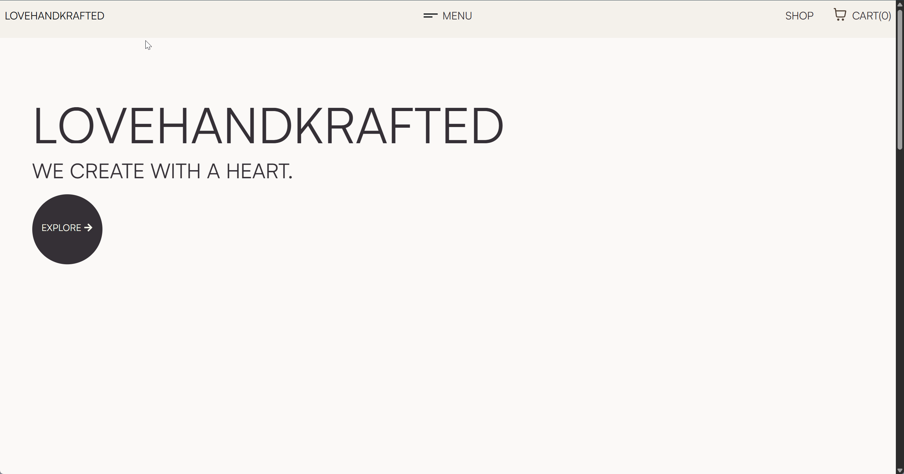

# Lovehandkrafted e-Commerce Shop
This repository contains all the code fpor the Lovehandkrafted Shop, a Phillipines based business that focuses on handcrafted items, ranging from home decor to accessories.
 
The online store is built to showcase products, provide an online presence and ultimately serve as an e-Commerce application.

# Visit The Site
Currently, the site is still under development. However, here are some progress images of the website:

# Features
- **PostgreSQL Database**: Stores detailed information about products and other relevant data such as user information.
- **Django Backend**: Powers a robust and secure RESTful API for managing all core functionalities: user authentication, product catalog orders, payments, and all CRUD operations for both customers and admins
- **ReactJS**: Provides a modern, responsive user interface using Tailwind CSS for styling and Framer Motion for smooth, interactive animations.

# Roadmap
#### Completed
- [x] Website skeleton
- [x] User authentication and permissions
- [x] Email Notifcation System
- [x] Admin Dashboard
- [x] Core CRUD operations
- [x] Newsletter
- [x] Basic Website Styling

#### In Progress
- [ ] Payment Integration
- [ ] Detailed Website Styling
- [ ] Testing + Cleanup
- [ ] Deployment

